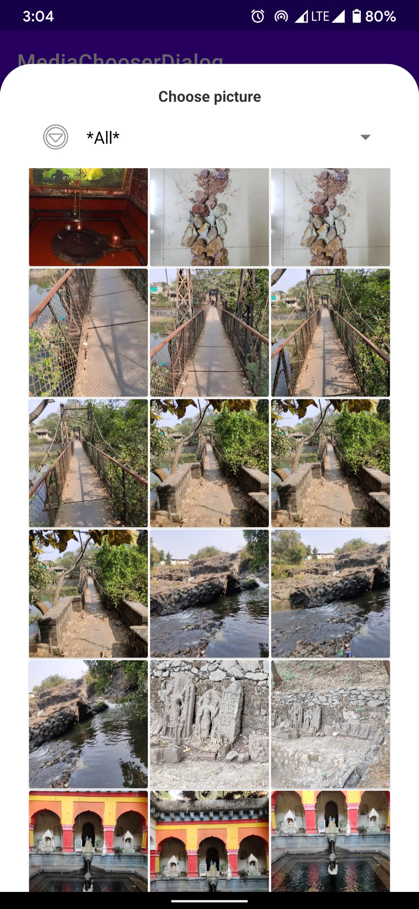

# Media Chooser Dialog
## _The Material Media Chooser Dialog Using Media Stores_


[](https://jitpack.io/#mrshadow98/MediaChooserDialog)

## Installation

To include MediaFacer in your project, your project should have minSdkVersion 19 and above.
You can download a aar from GitHub's [packages](https://github.com/mrshadow98/MediaChooserDialog/packages/737435) page.
Or use Gradle: Add it in your your projects root build.gradle file
```bash
allprojects {
		repositories {
			...
			maven { url 'https://jitpack.io' }
		}
	}
```
Add the dependency
```bash
dependencies {
	        implementation 'com.github.mrshadow98:MediaChooserDialog:1.0.3'
	}
```

Media Chooser Dialog is photos and videos selector compatible with android 11!
This chooser uses media stores so it solves the problem of requestLegactStorage in android 10.

- Material Design
- Easy to integrate
- ✨Uses Bottom Dialog

## Features

- Simple code that will load all pictures in users device
- Simple code that will load all videos in users device
- Returns path and Uri of the file
- checks and asks storage permission for you
- supports latest android 11
- followes google's latest storage policy

## Images



## Usage
1. Use below code to select video file
```java
MediaChooserDialog mediaChooserDialog = new MediaChooserDialog(MainActivity.this, new MediaChooserDialog.MediaSelectionListener() {
        @Override
        public void onMediaSelected(Uri uri, String path) {
            //uri is file uri
            //path is file path
        }
});
mediaChooserDialog.showVideoDialog();
```
2. Use below code to select picture files
```java
MediaChooserDialog mediaChooserDialog = new MediaChooserDialog(MainActivity.this, new MediaChooserDialog.MediaSelectionListener() {
        @Override
        public void onMediaSelected(Uri uri, String path) {
            //uri is file uri
            //path is file path
        }
});
mediaChooserDialog.showPictureDialog();
```

## Contributing
Pull requests are welcome. For major changes, please open an issue first to discuss what you would like to change.

Please make sure to update tests as appropriate.

## Used libraries
DialogSheet: https://github.com/marcoscgdev/DialogSheet
MediaFacer: https://github.com/CodeBoy722/MediaFacer
Glide: https://github.com/bumptech/glide
Dexter: https://github.com/Karumi/Dexter

## License

MIT

**Free Software, Hell Yeah!**
